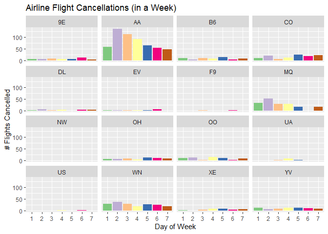
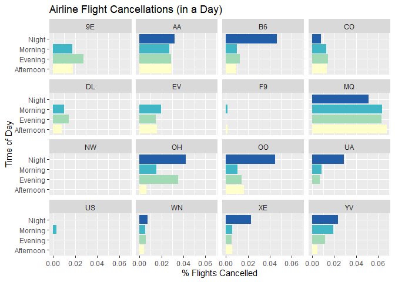
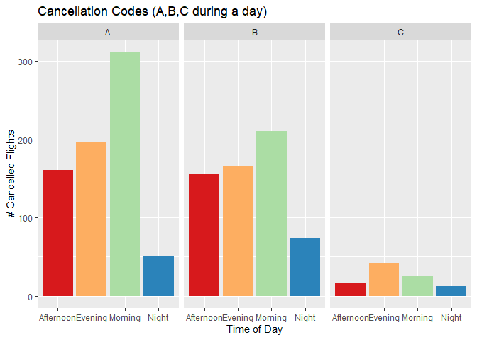

Intro to Machine Learning (STA380) - Part 2 Exercises
================
Satya Pal
15/08/2021

\#\#Problem 2: Visual story telling part 2: flights at ABIA

I would like to start this part with an anecdote. While I was traveling
from India to the US for joining the Masters program, I booked a flight
which was supposed to fly out from India at 11:45PM and land in the US
in morning. Unfortunately, the flight got delayed by 8 hours and it
would now fly out at 7:30 in the morning and land in the US in the
middle of the night. Not only I was sleepless for more than two days but
also I missed my connecting flight to Austin and could not attend my
classes for two days. If a few hours delay messes up with a person’s
plans this much, imagine what a flight cancellation can do to someone’s
plans. If only someone knows that which carrier on which day of the week
and time has a higher chance of a flight getting cancelled, someone can
plan better.

Here is a plot to see which day of the week is the worst in terms of
flight cancellation.

    ## 
    ##  9E  AA  B6  CO  DL  EV  F9  MQ  OH  OO  UA  US  WN  XE  YV 
    ##  51 568  62 118  20  14   2 170  58  62  17   2 183  29  64

<!-- -->

As mentioned in the description, we now should see what time of the day
the flights get cancelled more in order to avoid that.

<!-- -->

We can see that out of 12 airlines, only Northwest Airlines did not have
any cancellations.

Finally, the cancellation codes.

<!-- -->
